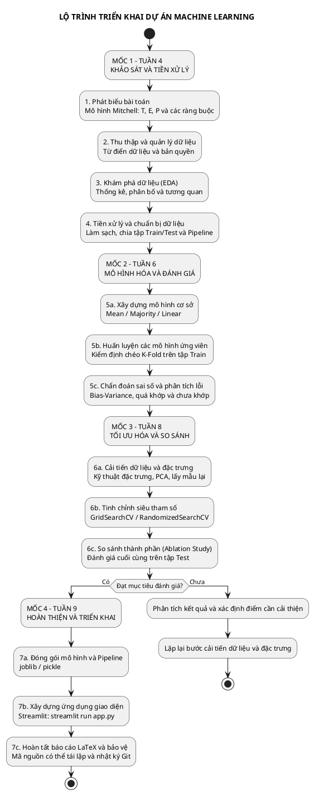

# Lộ trình triển khai dự án Machine Learning

```plantuml
@startuml
title LỘ TRÌNH TRIỂN KHAI DỰ ÁN MACHINE LEARNING

start

: MỐC 1 - TUẦN 4\nKHẢO SÁT VÀ TIỀN XỬ LÝ;

:1. Phát biểu bài toán\nMô hình Mitchell: T, E, P và các ràng buộc;
:2. Thu thập và quản lý dữ liệu\nTừ điển dữ liệu và bản quyền;
:3. Khám phá dữ liệu (EDA)\nThống kê, phân bố và tương quan;
:4. Tiền xử lý và chuẩn bị dữ liệu\nLàm sạch, chia tập Train/Test và Pipeline;

: MỐC 2 - TUẦN 6\nMÔ HÌNH HÓA VÀ ĐÁNH GIÁ;

:5a. Xây dựng mô hình cơ sở\nMean / Majority / Linear;
:5b. Huấn luyện các mô hình ứng viên\nKiểm định chéo K-Fold trên tập Train;
:5c. Chẩn đoán sai số và phân tích lỗi\nBias-Variance, quá khớp và chưa khớp;

: MỐC 3 - TUẦN 8\nTỐI ƯU HÓA VÀ SO SÁNH;

:6a. Cải tiến dữ liệu và đặc trưng\nKỹ thuật đặc trưng, PCA, lấy mẫu lại;
:6b. Tinh chỉnh siêu tham số\nGridSearchCV / RandomizedSearchCV;
:6c. So sánh thành phần (Ablation Study)\nĐánh giá cuối cùng trên tập Test;

if (Đạt mục tiêu đánh giá?) then (Có)
    :MỐC 4 - TUẦN 9\nHOÀN THIỆN VÀ TRIỂN KHAI;
    :7a. Đóng gói mô hình và Pipeline\njoblib / pickle;
    :7b. Xây dựng ứng dụng giao diện\nStreamlit: streamlit run app.py;
    :7c. Hoàn tất báo cáo LaTeX và bảo vệ\nMã nguồn có thể tái lập và nhật ký Git;
    stop
else (Chưa)
    :Phân tích kết quả và xác định điểm cần cải thiện;
    :Lặp lại bước cải tiến dữ liệu và đặc trưng;
    stop
endif

@enduml
```
